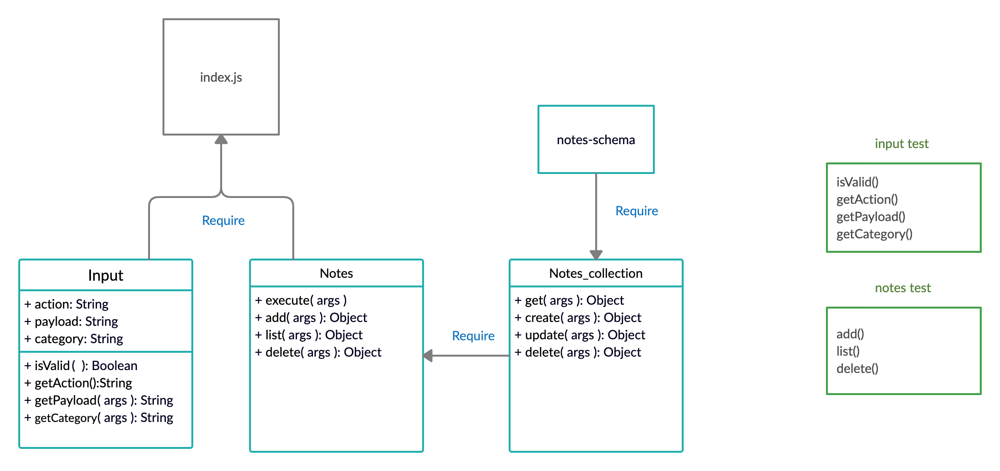

# Notesy

**Author**: Abdallah Safi
**Version**: 1.0.0 

## Overview
A terminal based (CLI) application allowing users to easily create and manage a list of categorized notes

## Getting Started

These instructions will get you a copy of the project up and running on your local machine for development and testing purposes. See deployment for notes on how to deploy the project on a live system.

## Prerequisites

- Operating system: Mac OS, Windows, Linux
- Git
  Follow the instruction in the links below to install git in your machine
  - [Windows](https://git-scm.com/download/win)
  - [Mac OS](https://git-scm.com/download/mac)
  - [Linux](https://git-scm.com/download/linux)
- [Codeing Editor](https://www.wpbeginner.com/showcase/12-best-code-editors-for-mac-and-windows-for-editing-wordpress-files/)

## Installation

1. open your terminal

2. Clone the repo

`git clone https://github.com/abdallahsafi-401-advanced-javascript/notes.git`

## Usage
1. add note:
 `node index.js --add or -a 'note content'`

## Architecture

This application was build with Node.js and it includes:
- minimist package
- dotenv package
- jest package 
- supergoose package

# UML diagram

## Change Log
10-09-2020 5:30pm - you can add, list and delete notes.

## Credits and Collaborations
<!-- Give credit (and a link) to other people or resources that helped you build this application. -->
